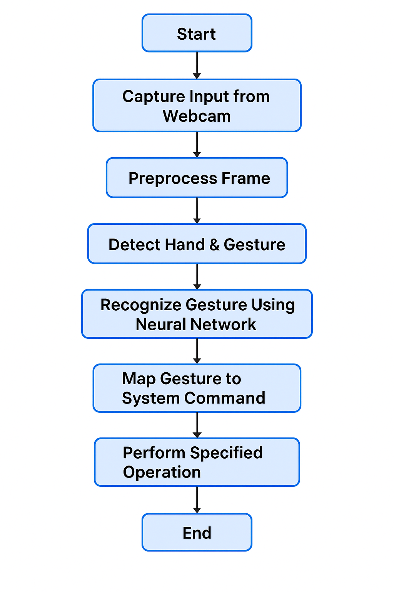

## 🎯 Project Overview
GesturePanda is a modern Windows-based Python application that uses your webcam and OpenCV to recognize dynamic hand gestures in real time and perform system actions such as play/pause media, scroll documents, adjust volume, and more.

---

## 🔍 Objective
Develop a real-time gesture recognition system that leverages a neural network to interpret hand gestures from webcam input and map them to system-level commands, enhancing user interaction and accessibility.

---

## 🧰 Tools & Technologies
| Component         | Description           |
|-------------------|----------------------|
| Programming Lang  | Python               |
| Libraries         | OpenCV, Pillow, Tkinter |
| IDE               | Visual Studio Code   |
| OS                | Windows 8 and above  |
| Hardware          | Integrated Webcam    |

---

## 🧱 System Architecture
1. **Input Layer:** Webcam captures real-time video.
2. **Preprocessing Layer:** Frame processing, background elimination, hand detection.
3. **Gesture Detection Layer:** Segmentation and tracking of hand.
4. **Neural Network Module:** Recognizes gesture from database.
5. **Command Execution Module:** Performs mapped system-level actions.
6. **UI Layer:** GUI for visualization and feedback.

---

## 📦 Functional Requirements
| Module   | Functionality                                                                 |
|----------|------------------------------------------------------------------------------|
| Module 1 | Capture live input from webcam and convert it to grayscale, filtered frames. |
| Module 2 | Track and detect hand region using motion detection and background subtraction. |
| Module 3 | Recognize gestures using trained neural network comparing with stored dataset. |
| Module 4 | Map recognized gesture to system command and execute it.                     |

---

## ✅ Non-Functional Requirements
- **Performance:** Real-time operation with minimal latency (<150ms)
- **Usability:** Easy to start, minimal user calibration
- **Portability:** Windows 8 or higher; Webcam required
- **Extensibility:** Modular code to add more gestures easily
- **Accuracy:** >90% gesture recognition accuracy with stable lighting

---

## 📊 Output Requirements & Use Cases
| Use Case                  | Gesture Performed         | Expected Output                | System Action                  | Confirmation                |
|---------------------------|--------------------------|-------------------------------|-------------------------------|-----------------------------|
| Play/Pause Media          | Open palm → close palm   | Gesture recognized as 'Pause/Play' | Toggle media state            | UI/Text pop-up              |
| Volume Up                 | Hand swipe up            | Gesture recognized as 'Volume Up'  | Increase volume               | Sound level bar change       |
| Volume Down               | Hand swipe down          | Gesture recognized as 'Volume Down'| Decrease volume               | Sound level bar change       |
| Scroll Document/Page Down | Two-finger swipe down    | Gesture recognized as 'Scroll Down'| Scroll page/document downward | Page shifts visibly          |
| Scroll Document/Page Up   | Two-finger swipe up      | Gesture recognized as 'Scroll Up'  | Scroll page/document upward   | Page shifts visibly          |
| Next Slide in PPT         | Right swipe              | Gesture recognized as 'Next Slide' | Move to next slide            | Slide transition             |
| Previous Slide in PPT     | Left swipe               | Gesture recognized as 'Previous Slide'| Move to previous slide     | Slide transition             |
| Exit Program              | Fist + move backward     | Gesture recognized as 'Exit'       | Program closes gracefully     | Exit pop-up message          |

---

## 🧪 Test Plan Overview
| Test Case             | Input                        | Expected Output                  | Pass Criteria                  |
|-----------------------|------------------------------|----------------------------------|-------------------------------|
| Webcam detection      | Camera ON                    | Frames captured successfully     | Frame stream shown in real-time|
| Gesture recognition   | Predefined hand gestures     | Correct label output             | ≥90% accuracy                  |
| Background elimination| Moving hand in front of still background | Hand segmented clearly | No background noise in the mask |
| Command execution     | Recognized gesture           | Correct OS-level command executed| Action performed within 1 sec  |

---

## 🔄 Future Enhancements
- Add 3D hand tracking for more complex gestures
- Integrate voice + gesture combo controls
- Extend for smart TV and IoT devices
- Create user-customizable gesture profiles

---

## 📈 System Flowchart



---

## 🚀 Getting Started
1. Clone this repository.
2. Install dependencies:
   ```bash
   pip install -r requirements.txt
   ```
3. Run the application:
   ```bash
   python ui/gui.py
   ```

---

## 👨‍💻 Authors & Contributors
- [Your Name]

---

## 📄 License
This project is licensed under the MIT License.
